<div align="center">

# 🎨 Anime Face Generator

### Generate High-Quality Anime Faces using Deep Convolutional GAN (DCGAN)

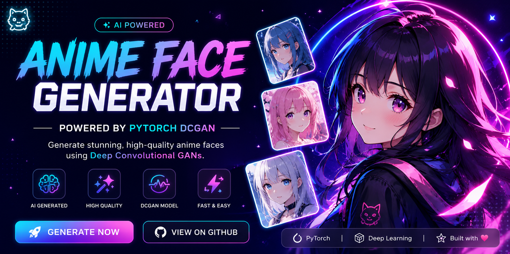

<br>

[](https://anime-facegenerator.streamlit.app/)
[](https://www.python.org/)
[](https://pytorch.org/)
[](https://streamlit.io/)
[](https://pytorch.org/vision/)
[]
[]

---

### 🌐 Live Website

## 🚀 https://anime-facegenerator.streamlit.app/

---

### ⭐ If you like this project, don't forget to star the repository!

</div>

---

# 📖 About The Project

Anime Face Generator is a **Deep Learning project** built using **PyTorch** that generates completely new anime faces from random noise.

The model is trained using a **Deep Convolutional Generative Adversarial Network (DCGAN)** on thousands of anime face images. Instead of copying existing faces, the Generator learns the underlying distribution of anime faces and creates entirely new ones.

The project includes a modern **Streamlit Web Application** where users can generate multiple anime faces instantly and download the generated image.

---

# ✨ Features

- 🎨 Generate realistic anime faces
- ⚡ Fast inference
- 🧠 Custom trained DCGAN
- 🖼️ Generate **1, 4, 16 or 64** faces
- 📥 Download generated image
- 🌙 Premium Dark UI
- 🚀 Live deployed web application
- 💻 Built completely using PyTorch
- 📊 Training progress visualization
- 📱 Responsive Streamlit interface

---

# 🚀 Live Demo

Click below to try it yourself.

### 🌍 https://anime-facegenerator.streamlit.app/

---

# 📊 Project Statistics

| Feature | Value |
|----------|--------|
| 🧠 Model | Deep Convolutional GAN (DCGAN) |
| 💻 Framework | PyTorch |
| 🎨 Resolution | 128 × 128 |
| 🌈 Image Channels | RGB |
| 🔥 Latent Dimension | 100 |
| 📦 Batch Size | 64 |
| 📈 Training Epochs | 100 |
| ⚙ Optimizer | Adam |
| 📉 Loss Function | BCEWithLogitsLoss |
| 🚀 Deployment | Streamlit Cloud |

---

# 🛠 Tech Stack

<div align="center">

| Technology | Purpose |
|------------|---------|
| 🐍 Python | Programming Language |
| 🔥 PyTorch | Deep Learning |
| 🖼 TorchVision | Image Processing |
| 🌐 Streamlit | Web Application |
| 📸 Pillow | Image Handling |
| 🔢 NumPy | Numerical Operations |
| 💾 Git | Version Control |
| ☁ GitHub | Source Code Hosting |

</div>

---

# 🌟 Why This Project?

This project demonstrates the complete Deep Learning workflow:

- Dataset Preparation
- DCGAN Architecture
- Model Training
- Generator & Discriminator Design
- Weight Initialization
- Checkpoint Saving
- Resume Training
- Image Generation
- Streamlit Deployment
- GitHub Version Control

It is designed as a complete end-to-end AI project rather than only a training notebook.

---

# 📸 Preview

> 📌 Sample generated faces

*(Preview image will be added in Part 2.)*

---

# 🏆 Highlights

- ✅ Custom DCGAN implementation
- ✅ End-to-End Deep Learning Pipeline
- ✅ Modern UI
- ✅ Live Deployment
- ✅ Open Source
- ✅ Beginner Friendly Code
- ✅ Professional Project Structure

---

# 📑 Table of Contents

- 📖 About
- ✨ Features
- 📊 Project Stats
- 🛠 Tech Stack
- 📸 Sample Output
- 📈 Training Progress
- 🧠 Model Architecture
- 📂 Project Structure
- ⚙ Installation
- 🚀 Usage
- 🌍 Deployment
- 📈 Future Improvements
- 👨‍💻 Author
---


---

# 🎯 Training Progress

Watching the Generator improve during training.

<div align="center">

| Epoch 1 | Epoch 10 |
|----------|----------|
| 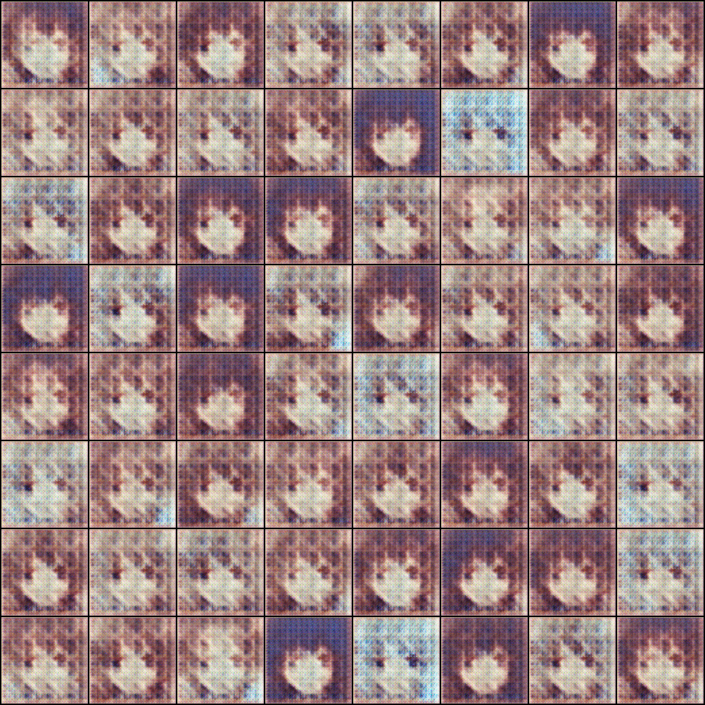 | 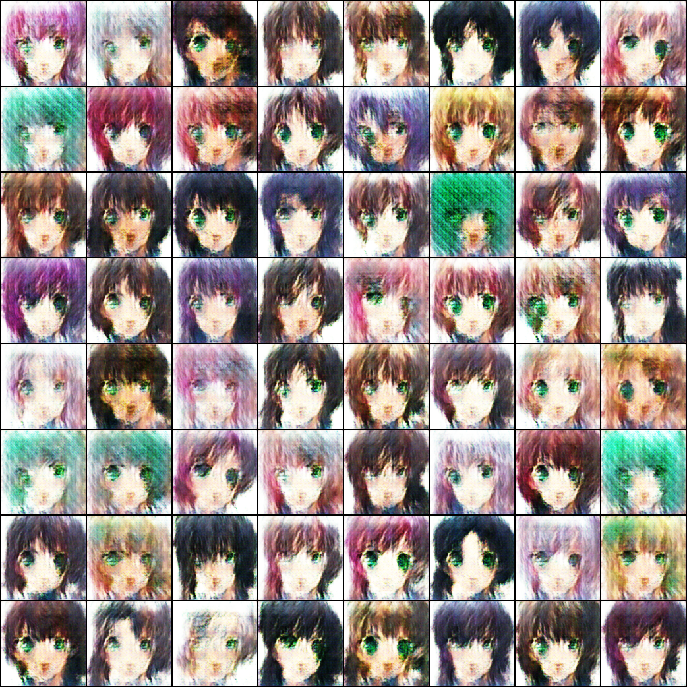 |

| Epoch 20 | Epoch 40 |
|----------|----------|
| 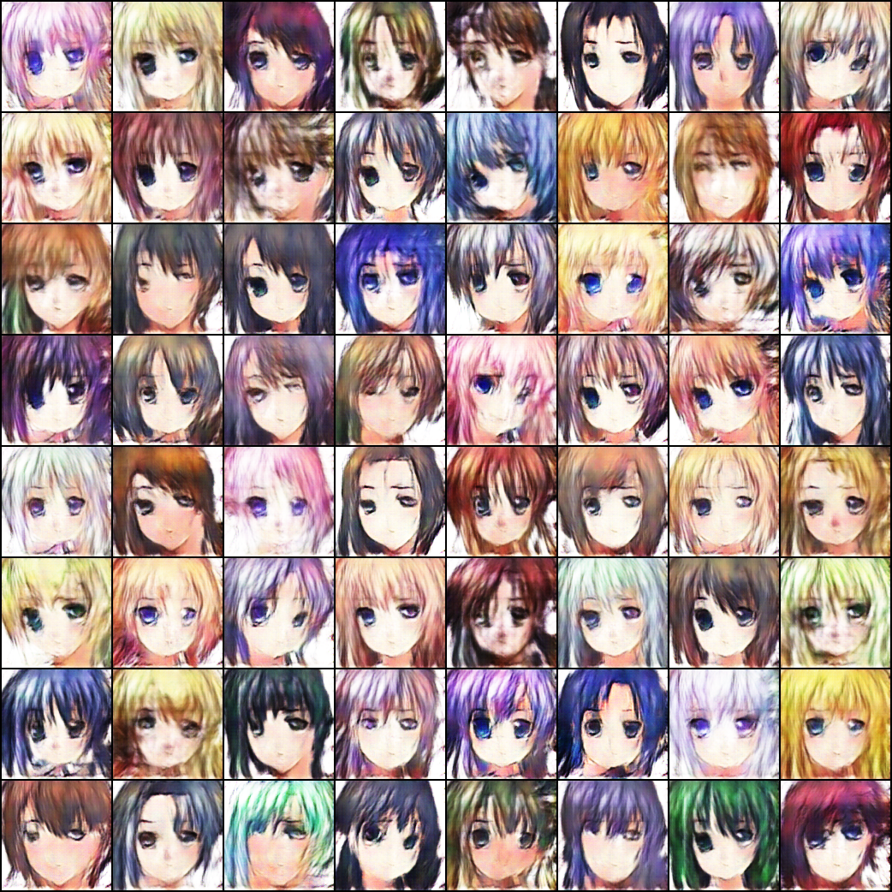 | 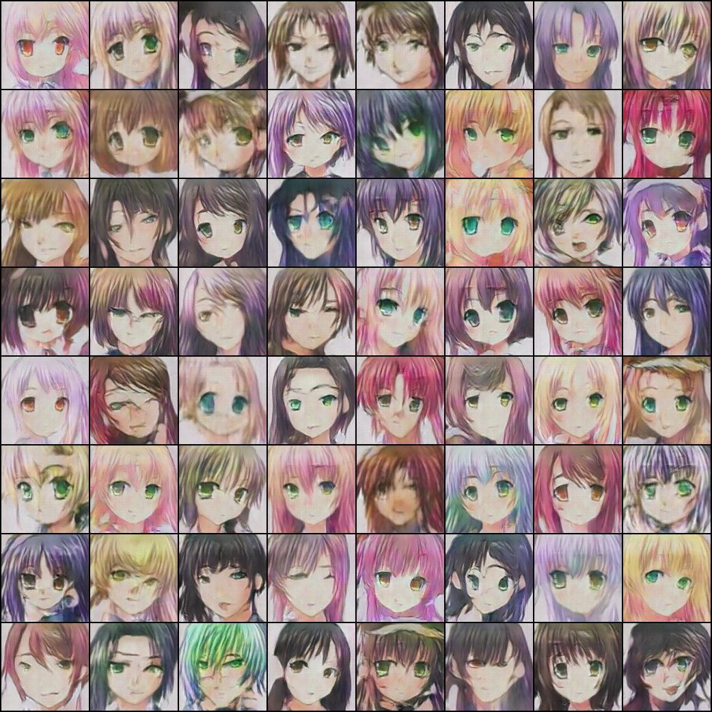 |

| Epoch 60 | Epoch 80 |
|----------|----------|
| 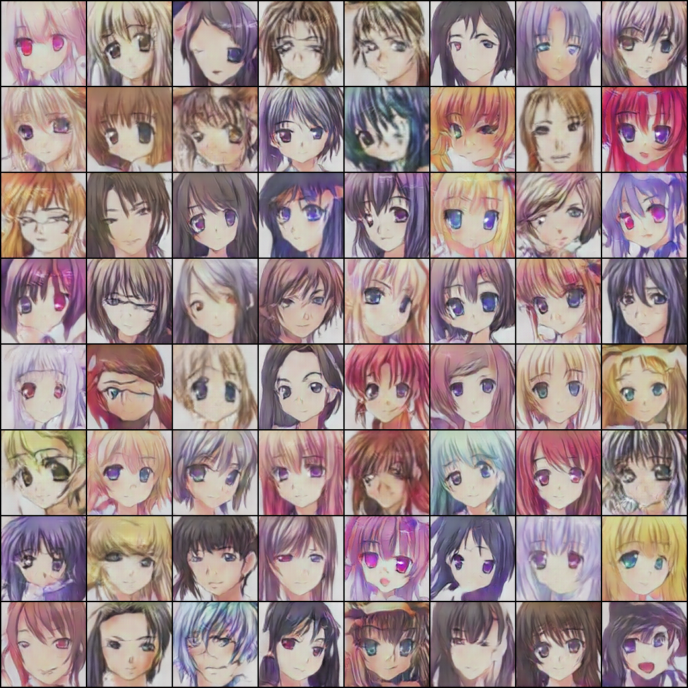 | 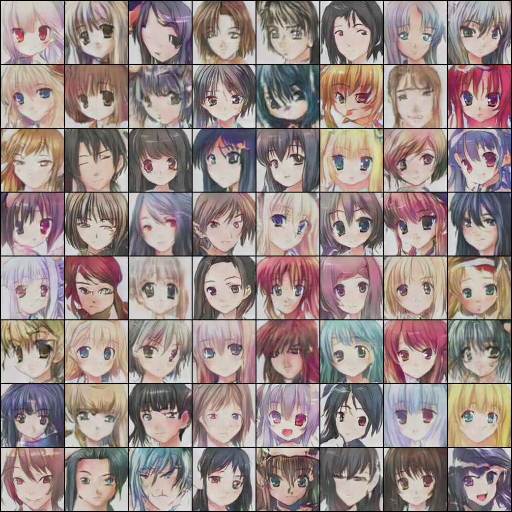 |

| Epoch 100 |
|-----------|
| 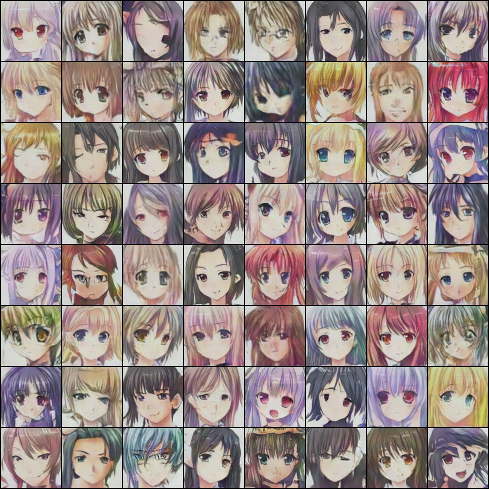 

</div>

---

# 📈 Training Summary

| Metric | Value |
|---------|-------|
| Dataset | Anime Face Dataset |
| Images | 63,000+ |
| Resolution | 128×128 |
| Epochs | 100 |
| Batch Size | 64 |
| Optimizer | Adam |
| Learning Rate | 0.0002 |
| Loss | BCEWithLogitsLoss |
| Device | CUDA GPU |

---

# 🧠 DCGAN Architecture

```
                 Random Noise (100)

                        │

                        ▼

               +------------------+
               |    Generator     |
               +------------------+

                        │

                        ▼

          Generated Anime Face (128×128)

                        │

                        ▼

             +--------------------+
             |   Discriminator    |
             +--------------------+

                        │

            ┌───────────┴───────────┐

            ▼                       ▼

        Real Face              Fake Face

            │                       │

            └───────────┬───────────┘

                        ▼

                  Binary Classification

                        ▼

                Generator Improves
```

---

# 📂 Project Structure

```text
AnimeFaceGenerator/
│
├── assets/
│   ├── banner.png
│   └── style.css
│
├── generated/
│   └── sample_output.png
│
├── models/
│   └── generator_final.pth
│
├── app.py
├── generate.py
├── inference.py
├── model.py
├── utils.py
├── requirements.txt
├── README.md
└── .gitignore
```

---

# ⚙️ Installation

## 1️⃣ Clone Repository

```bash
git clone https://github.com/GurlalSingh22/AnimeFaceGenerator.git
```

---

## 2️⃣ Open Project

```bash
cd AnimeFaceGenerator
```

---

## 3️⃣ Install Dependencies

```bash
pip install -r requirements.txt
```

---

## 4️⃣ Run the Application

```bash
streamlit run app.py
```

---

# 🚀 Usage

### Step 1

Open the application.

---

### Step 2

Choose the number of anime faces.

- 1 Face
- 4 Faces
- 16 Faces
- 64 Faces

---

### Step 3

Click

```
🚀 Generate Faces
```

---

### Step 4

Wait a few seconds.

---

### Step 5

Download the generated image.

---

# 📸 Application Preview

<div align="center">

 sample 1 | Epoch 10 |
|----------|----------|
| 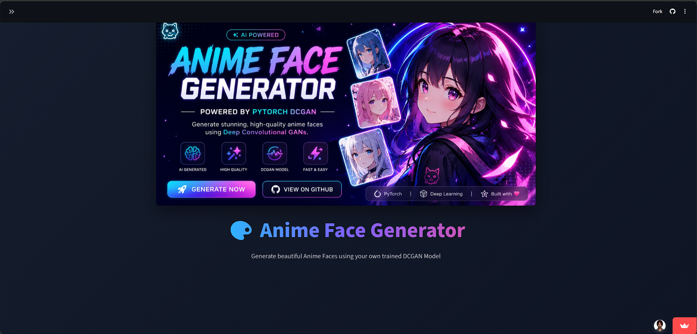 | 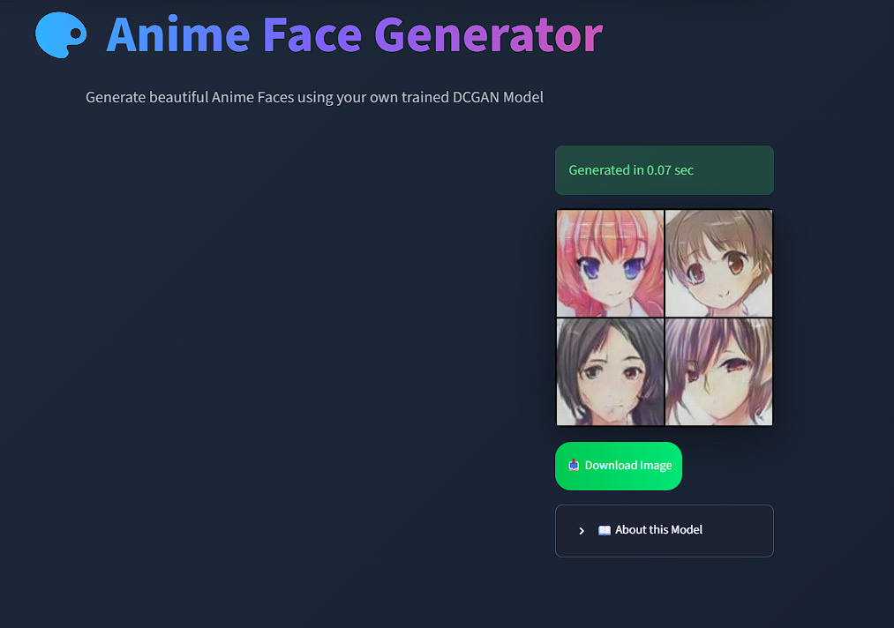 |

| Epoch 20 | Epoch 40 |
|----------|----------|
|  | 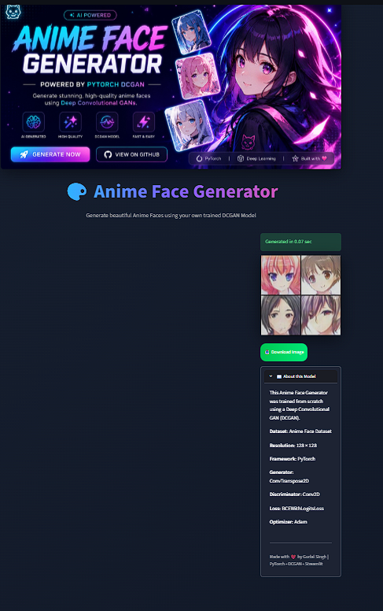 |

</div>

> Replace `app_preview.png` with a screenshot of your deployed Streamlit application.

--- 
